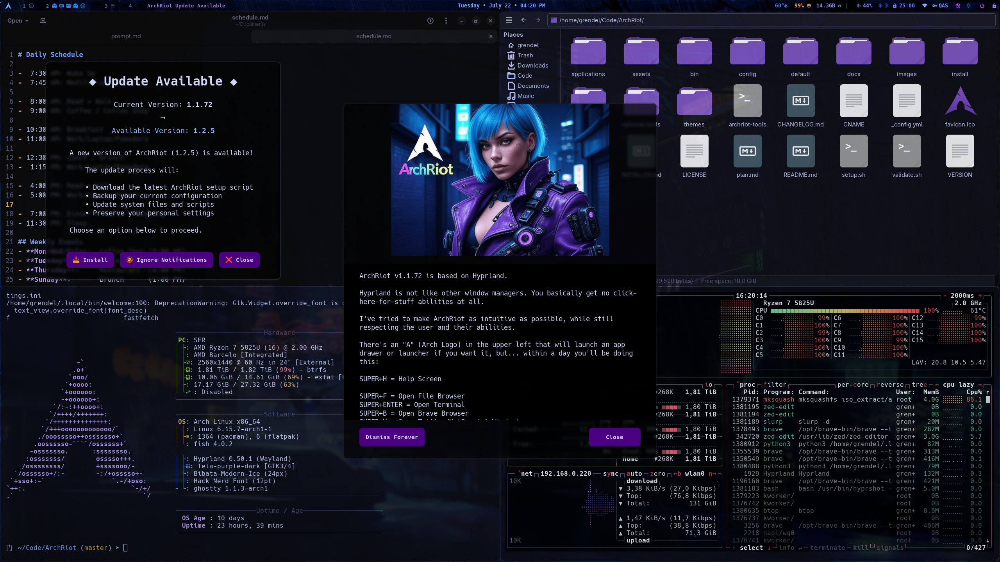

<div align="center">

# :: 𝔸𝕣𝕔𝕙ℝ𝕚𝕠𝕥 ::


[](https://x.com/CyphrRiot)
[](https://github.com/CyphrRiot)
[](https://github.com/CyphrRiot/Migrate)

</div>

## **ArchRiot: A Modern & Beautiful, Opinionated Arch Linux System**

ArchRiot is a privacy-focused Arch Linux setup that delivers a complete, functional environment with a single command. Built around the Hyprland tiling window manager for fast, keyboard-driven workflows.

**What You Get:**

- **One-Command Install:** Complete setup in minutes
- **Hyprland Tiling:** Efficient window management that enhances productivity
- **Development Ready:** Preconfigured with Zed IDE, nvim, and themes
- **Beautiful Aesthetics:** Custom themes with adaptive backgrounds for focused work
- **Privacy First:** No telemetry, no data collection, privacy-respecting applications
- **Fully Customizable:** Modify, extend, or strip down to your exact needs

_Created by an experienced developer and privacy advocate - this is the Linux system I've always wanted to use._

_Note: ArchRiot is very opinionated setup and was originally a unique rice[^1] and then a fork of [DHH's Omarchy](https://omarchy.org/){:target="\_blank"} installer with extensive customizations focused on privacy, development productivity, and clean aesthetics._

[^1]: In the context of Linux, "rice" is slang for customizing or tweaking a desktop environment or user interface to make it look aesthetically pleasing or highly personalized, often with a focus on minimalism, unique themes, or lightweight setups. It comes from the term "ricer," originally used in car culture to describe heavily modified cars (inspired by "rice burner" for Japanese cars).



---

## Table of Contents

- [Installation](#-installation)
- [VM Installation Notes](#️-vm-installation-notes)
- [Installation Features](#installation-features)
- [What's New](#-whats-new)
- [Built-in Backup & Recovery](#-built-in-backup--recovery-with-migrate)
- [Essential Commands](#️-essential-commands)
- [Key Customizations](#-key-customizations)

## 🚀 Installation

### Prerequisites: Fresh Arch Linux Setup

Download the Arch Linux ISO, put it on a USB stick (use balenaEtcher on Mac/Windows), and boot from the stick.

**WiFi Setup** (skip if using ethernet):

1. Run `iwctl`
2. Type `station wlan0 scan`
3. Type `station wlan0 connect <tab>`
4. Pick your network from the list
5. Enter your WiFi password

Run `archinstall` and pick these options (and leave anything not mentioned as-is):

| Section                  | Option                                                                         |
| ------------------------ | ------------------------------------------------------------------------------ |
| Mirrors and repositories | Select regions > Your country                                                  |
| Disk configuration       | Partitioning > Default partitioning layout > Select disk (with space + return) |
| Disk > File system       | btrfs (default structure: yes + use compression)                               |
| Disk > Disk encryption   | Encryption type: LUKS + Encryption password + Partitions (select the one)      |
| Hostname                 | Give your computer a name                                                      |
| Root password            | Set yours                                                                      |
| User account             | Add a user > Superuser: Yes > Confirm and exit                                 |
| Audio                    | pipewire                                                                       |
| Network configuration    | Copy ISO network config                                                        |
| Additional packages      | Add wget (type "/wget" to filter list)                                         |
| Timezone                 | Set yours                                                                      |

**⚠️ Important:** You must setup disk encryption to use ArchRiot as designed! The setup relies exclusively on disk encryption to secure your device, as it'll auto-login the user after the disk has been decrypted at boot.

Once Arch has been installed, pick reboot, login with the user you just setup, and now you're ready to install ArchRiot.

### Method 1: One-Line Install or Upgrade (Recommended for Most Users)

```bash
curl -fsSL https://archriot.org/setup.sh | bash
```

**Note: Upgrading is exactly the same command! Simple!**

### Method 2: Manual Clone (Only if You Need to Customize Installation Scripts)

Use this method only if you want to modify the installation scripts before running them:

```bash
git clone https://github.com/CyphrRiot/ArchRiot.git ~/.local/share/archriot
~/.local/share/archriot/install.sh
```

**Note:** Most users should use Method 1 above. This manual method is only for advanced users who need to customize the installation process.

## 🖥️ VM Installation Notes

_Thanks to [DTWaling on X](https://x.com/DTWaling) for VM installation guidance._

### Disk Partitioning in VirtualBox

The Arch Linux installer's auto partitioning might not detect the full disk space allocated by VirtualBox. If this happens, archinstall will partition based on the actual space pre-allocated by VirtualBox rather than the full virtual disk size.

**Solutions:**

1. **Pre-allocate full space:** In VirtualBox disk settings, pre-allocate the full disk space before installation
2. **Manual partitioning:** Use `gdisk` to create your own EFI boot and root partitions, then configure archinstall to use your pre-configured partitions

### Plymouth Installation Issues

If installation stops at the "running: plymouth" step (95% progress) and returns to command prompt:

**The installation is likely 99% complete!** Plymouth is a boot splash screen and not essential for desktop functionality.

**To complete installation:**

```bash
# Navigate to ArchRiot directory
cd ~/.local/share/archriot

# Complete remaining steps (run with bash in fish shell)
bash -c "sudo updatedb && fc-cache -fv"

# Verify core components
which waybar && echo "✓ Waybar OK" || echo "❌ Waybar missing"
which hyprland && echo "✓ Hyprland OK" || echo "❌ Hyprland missing"

# Reboot to apply all configurations
reboot
```

**To install Plymouth later:**

```bash
cd ~/.local/share/archriot
bash install/plymouth.sh
```

### Optional: Pre-Installation Validation

Want confidence before installing? Run the validation script to test compatibility:

```bash
wget https://cyphrriot.github.io/ArchRiot/validate.sh
bash validate.sh
```

This comprehensive test validates:

- System requirements (Arch Linux, internet, disk space)
- Package availability (Hyprland, Waybar, etc.)
- GPU compatibility and Wayland support
- Repository accessibility and theme integrity
- User environment and permissions

**Results**: Pass/fail report with specific guidance before you commit to installation.

### Installation Features

- **Automatic backup** - Creates timestamped backup of existing configs
- **Dependency verification** - Ensures Python3 and required packages
- **Script validation** - Verifies all waybar modules are functional
- **Error handling** - Clear feedback and rollback capability
- **100% confidence** - Comprehensive testing and validation


## 🆕 **What's New**

**Critical Installer Fixes (v1.1.57)**

- 🔥 **Fixed Hidden Desktop Files** - Unwanted applications (btop++, About Xfce, etc.) no longer appear in Fuzzel menu
- 📁 **Fixed Thunar Bookmarks** - No more "Failed to open file://$HOME/..." errors
- 🎨 **Fixed Missing Icons** - Web applications now display proper icons (Proton Mail, Google Messages, X, Activity, Zed)
- 🌐 **Fixed Web App Installation** - Custom web applications now properly install with correct icon references
- 🧹 **Clean Fresh Installs** - All installer bugs resolved for professional out-of-the-box experience

**Previous Major Improvements**

- 🚀 **Faster System Updates** - New `upgrade-system` command with better progress tracking and error handling
- 🔄 **Automatic Update Notifications** - Built-in version checking with periodic notifications for new releases
- 🎯 **Smart App Launching** - SUPER+G intelligently opens or focuses Signal and other applications
- 🎨 **Visual Polish** - Fixed fonts and improved consistency across all interfaces
- 📱 **Better Status Bar** - Enhanced Waybar with improved modules and transparency
- 🪟 **Smoother Window Management** - Better handling of application focus and workspace switching

**For Developers & Power Users:**

- Enhanced keybinding logic with graceful instance handling
- Parallel downloads and intelligent error recovery in upgrade system
- Improved backup integration and .pacnew file detection
- Cross-platform README formatting improvements

This release focuses on rock-solid installation reliability with comprehensive testing and validation.

## 💾 **Built-in Backup & Recovery with Migrate**

ArchRiot automatically installs and integrates **[Migrate](https://github.com/CyphrRiot/Migrate)** - a powerful backup and recovery tool also created by Cypher Riot. This separate project is downloaded and configured during ArchRiot installation to provide seamless backup capabilities. Never lose your configurations again!

### 🛡️ **Why Migrate Matters**

- **Complete System Backup** - Captures all your dotfiles, configurations, and customizations
- **Interactive TUI** - Beautiful text interface makes backup/restore simple
- **Live System Recovery** - Restore without reinstalling your entire system
- **Cross-Installation Migration** - Move your setup between different machines
- **Automatic Updates** - Always gets the latest version during ArchRiot installation

### 🔥 **Quick Start**

```bash
migrate                              # Launch interactive backup/restore interface
```

**No flags, no complexity** - just run `migrate` and use the intuitive menu to backup or restore your entire ArchRiot setup in minutes!

[](https://github.com/CyphrRiot/Migrate)

## ⌨️ Essential Commands

### Getting Started

```bash
SUPER + H                            # Show HELP (SUPER Key Bindings)
SUPER + D  or  SUPER + SPACE         # App launcher (fuzzel)
SUPER + RETURN                       # Open terminal (Ghostty)
SUPER + L                            # Lock screen (CypherRiot theme)
SUPER + ESCAPE                       # Power menu
```

### Window Management (Most Used)

```bash
SUPER + W  or  SUPER + Q             # Close window
SUPER + V                            # Toggle floating
SUPER + J                            # Toggle split
SUPER + Arrow Keys                   # Move focus
SUPER + SHIFT + Arrow Keys           # Swap windows
SUPER + CTRL + Arrow Keys            # Smart window movement
SUPER + 1-4                          # Switch workspace
SUPER + SHIFT + 1-4                  # Move window to workspace
```

### Core Applications

```bash
SUPER + F                            # File manager (Thunar)
SUPER + B                            # Browser (Brave)
SUPER + Z                            # Code editor (Zed)
SUPER + N                            # Text editor (Neovim)
SUPER + O                            # Text editor (Gnome Text Editor)
SUPER + T                            # System monitor (btop)
SUPER + SHIFT + RETURN               # Centered floating terminal
```

### Communication & Social

```bash
SUPER + E                            # Email (Proton Mail)
SUPER + G                            # Signal messenger (smart launcher)
SUPER + M                            # Google Messages
SUPER + X                            # X/Twitter
```

### Screenshots & Recording

```bash
SUPER + SHIFT + S                    # Region screenshot
SUPER + SHIFT + W                    # Window screenshot
SUPER + SHIFT + F                    # Full screen screenshot
SUPER + PRINT                        # Color picker
Kooha                                # GUI screen recorder (launch from SUPER+D)
```

### Theme & Appearance

```bash
theme-next                           # Switch to next theme
SUPER + CTRL + SPACE                 # Cycle through backgrounds
SUPER + CTRL + SHIFT + SPACE         # Switch themes (keybind)
```

### System Management

```bash
upgrade-system                       # Optimized system upgrade utility (ArchRiot enhanced)
upgrade-system --all --backup        # Full automated upgrade with backup
upgrade-system --dry-run             # Preview available updates

migrate                              # Backup/restore system (interactive TUI)
sudo systemctl reboot                # Restart system
sudo systemctl poweroff              # Shutdown system
```

### Audio & Media

```bash
XF86AudioRaiseVolume                 # Volume up (hardware buttons)
XF86AudioLowerVolume                 # Volume down (hardware buttons)
XF86AudioMute                        # Toggle mute (hardware buttons)
XF86AudioMicMute                     # Toggle microphone (hardware buttons)
XF86AudioPlay/Pause                  # Media play/pause (hardware buttons)

# Beautiful volume overlay appears for 1 second with progress bar
# These are actual hardware keys, not application shortcuts
```

### Waybar Controls (Status Bar)

```bash
Click tomato timer                   # Start/pause Pomodoro timer
Double-click tomato timer            # Reset timer to 25:00
Click microphone icon               # Toggle microphone mute
Click network icon                  # Open network manager
```

### Fix Scripts (If Needed)

```bash
fix-thunar-thumbnails                # Fix thumbnail generation
fix-background                       # Fix theme backgrounds
```

### 🔧 Troubleshooting

Quick fixes for common issues:

- **Initramfs errors**: Fixed in v1.0.1 - update if experiencing build issues
- **Reliable installer**: Rock-solid installation process with comprehensive error handling
- **Background issues**: Run `fix-background`
- **Thumbnail problems**: Run `fix-thunar-thumbnails`

## 🎯 Key Customizations

### 🔧 **Core System Changes**

- **Terminal:** Ghostty (replaces Kitty) with 90% transparency and dark theme
- **Browser:** Brave (replaces Chromium) with native Wayland support
- **File Manager:** Thunar (replaces Nautilus) with comprehensive dark theming
- **Shell:** Fish as default (replaces Bash) with proper PATH configuration
- **Theme:** CypherRiot as default (replaces Tokyo Night)
- **Code Editor:** Zed (Wayland) + Neovim with proper theme integration
- **Applications:** All major apps now run native Wayland (no more XWayland issues)
- **Migrate Backup Tool:** CyphrRiot's comprehensive system backup/restore solution (built-in)
- **Memory Optimization:** Intelligent memory management that actually works
- **Blue Light Filter:** Optional hyprsunset at 3500K for reduced eye strain (configurable during install)
- **GTK Theming:** Dark theme everywhere - no more jarring white dialogs
- **DPI Scaling:** Fixed scaling issues for consistent UI across all applications

#### 🧠 **Memory Management Fix**

Linux's default memory management is **aggressively stupid** about caching. The kernel will happily consume 90%+ of your RAM for file caches, then struggle to free it when applications actually need memory.

**ArchRiot's Solution:** Intelligent memory management tuning that provides:

- **No more lag spikes** when opening applications
- **Better responsiveness** under memory pressure
- **Reduced swap usage** with proper RAM utilization
- **Optimized caching** that doesn't hog system resources

**Result:** Your system stays fast and responsive even when running multiple applications.

### 📱 **Advanced Waybar Integration**

ArchRiot includes a highly customized Waybar (status bar) with comprehensive system integration:

**Built-in Modules:**

- **Tomato Timer** - Built-in Pomodoro timer with visual states (idle/running/break/finished)
- **Mullvad VPN Status** - Real-time VPN connection status with location display
- **System Monitoring** - CPU aggregate usage, accurate memory monitoring
- **Microphone Control** - Visual mic status with one-click toggle
- **Network Management** - WiFi status with nmtui integration
- **Audio Controls** - Volume display with hardware key integration

**Technical Improvements:**

- **CSS Parser Fixed** - Eliminated all !important declarations causing waybar errors
- **Custom Separators** - Clean, organized module layout for better readability
- **Transparency System** - Consistent 90-98% opacity across all applications
- **Font Optimization** - Proper sizing (100%) and improved date format (Sunday • July 13 • 01:49 PM)
- **Error-free Operation** - All modules validated and tested for reliability

### 📱 **Clean Web Applications**

- **Proton Mail** (SUPER+E / XF86Mail) - Privacy-focused email in floating window
- **Signal** (SUPER+G) - Private messaging app
- **Google Messages** (SUPER+M) - Web-based messaging in floating window
- **X/Twitter** (SUPER+X) - Social platform in floating window
- **GitHub** - Development platform with proper icons from homarr-labs

### 🪟 **Responsive Window Management**

- **Percentage-based sizing** - Windows scale properly across different screen resolutions (1080p, 1440p, 4K, ultrawide)
- **Smart centering** - All floating windows automatically center regardless of monitor size
- **Cross-resolution compatibility** - No hardcoded pixel positions, works on any display setup
- **Optimized app windows**:
    - **X/Twitter**: `850x90%` (mobile-style layout with responsive height)
    - **Proton Mail**: `1000x75%` (perfect email reading dimensions)
    - **Google Messages**: `1000x75%` (comfortable messaging interface)
    - **Signal**: `1000x1080` (maintains native desktop experience)
- **Future-proof design** - Window rules adapt automatically to new monitor configurations

### 🎮 **GPU Support**

ArchRiot automatically detects and installs optimal drivers for all major GPUs:

- **NVIDIA**: Proprietary drivers with Wayland and hardware acceleration
- **AMD/Radeon**: Open-source Mesa drivers with Vulkan support
- **Intel**: Mesa drivers including Intel Arc support

All GPUs get proper Wayland integration and hardware video acceleration for optimal performance.

**Performance Features:**

- **Hardware acceleration** - Video playback, compositing effects, and application rendering
- **Wayland native support** - No XWayland compatibility issues
- **Automatic driver selection** - No manual configuration required
- **Vulkan support** - Modern graphics API for gaming and development
- **Multi-monitor optimization** - Proper scaling and display management

### ⌨️ **Enhanced Keybindings & Productivity**

- **SUPER+D** = **SUPER+SPACE** (Unified app launcher)
- **Left-click Arch icon** - nwg-drawer app grid
- **Right-click Arch icon** - fuzzel app launcher
- **XF86Mail** - Floating Proton Mail window
- **SUPER+SHIFT+S** - Region screenshot (primary)
- **SUPER+SHIFT+W** - Window screenshot
- **SUPER+SHIFT+F** - Full screen screenshot
- **Key repeat enabled** (40 rate, 600 delay for responsive typing)
- **All media keys** - Volume, brightness, playback controls

### 🎨 **Document & Media Handling**

- **Gnome Text Editor** - Default for text/markdown files (clean, modern text editing with Tokyo Night theme)
- **Papers** - Default PDF viewer (GNOME's modern document viewer)
- **MPV** - Video playback with optimal performance
- **Better waybar network** - nmtui instead of impala for reliable WiFi management
- **Screenshot tools** - grim/slurp/hyprshot integration for all capture needs
- **Screen recording** - Kooha for simple GUI-based screen recording

### 🚫 **Removed Bloat & Corporate Apps**

- **Removed 37signals/Basecamp tools** - Hey, Basecamp web apps
- **Removed corporate social** - Discord, proprietary messaging
- **Removed heavy productivity** - Obsidian, LibreOffice, OBS Studio, KDEnlive, Pinta
- **Removed proprietary services** - 1Password, Typora, Dropbox, Spotify, Zoom
- **Removed entertainment** - YouTube webapp, WhatsApp webapp

## 🔄 System Management

### Updates

```bash
update                               # Manual system update (legacy)
version-check --test                 # Check for available ArchRiot updates
version-check --force                # Force update check (ignores timing)
version-check --reset                # Reset update notification settings
```

**Automatic Update Notifications**: ArchRiot now automatically checks for updates every 4 hours and shows a notification dialog when newer versions are available. You can install updates, ignore notifications, or simply close the dialog.

<div align="center">

<br><em>Automatic update notification dialog with one-click installation</em>
</div>

Updates ArchRiot by pulling latest changes and re-running the installer. Simple, safe, and reliable - no dangerous migrations.

### Backup & Restore

```bash
migrate
```

**🎯 Migrate** is a separate project by Cypher Riot that gets automatically installed during ArchRiot setup. It's a TUI (Text User Interface) with **no command-line options**. Simply run the command and use the interactive menu to:

- Create comprehensive system backups
- Restore from previous backups
- Migrate configurations between installations
- Preserve all your customizations

**Integration Details:** ArchRiot automatically downloads and installs the latest version of Migrate from [CypherRiot/Migrate](https://github.com/CyphrRiot/Migrate) during installation, ensuring you always have the most current backup capabilities without any manual setup.

## 🎨 Themes & Customization

### Available Themes

ArchRiot includes two carefully curated themes, each with complete system integration:

#### **cypherriot** (Default Theme)

- **Visual Style:** Custom purple/blue aesthetic with dark elegance
- **Color Palette:** Deep purples, electric blues, and charcoal backgrounds
- **Waybar Integration:** Fully customized status bar with matching colors
- **Applications:** Consistent theming across terminal, file manager, and editors
- **Backgrounds:** 6 riot-themed wallpapers including `riot_zero.png` default

#### **tokyo-night** (Alternative Theme)

- **Visual Style:** Vibrant city lights with modern cyberpunk vibes
- **Color Palette:** Neon blues, electric purples, and deep blacks
- **Inspiration:** Tokyo's neon-lit streets and cyberpunk aesthetics
- **Applications:** Matching terminal and editor themes
- **Backgrounds:** 6 night-themed wallpapers with urban/tech aesthetics

### Theme Management & Customization

**Quick Theme Switching:**

- **Switch themes:** `theme-next` command cycles between available themes
- **Instant application:** Changes apply immediately to all running applications
- **Persistent settings:** Theme choice survives reboots and updates

**Background System:**

- **Automatic matching:** Backgrounds automatically match your active theme
- **Multiple variants:** Each theme includes 6 carefully selected wallpapers
- **Easy cycling:** Use `SUPER + CTRL + SPACE` to cycle through theme backgrounds
- **Time-based variants:** Optional time-of-day background switching

**Advanced Customization:**

- **Theme location:** `~/.config/archriot/current/theme` (symlink to active theme)
- **Custom themes:** Add your own themes to `~/.config/archriot/themes/`
- **Background override:** Manually set backgrounds in `~/.config/archriot/current/background`
- **Application integration:** Themes automatically apply to Waybar, terminal, editors, and GTK apps

## ⚡ Key Features & Performance

### Window Management

- **Hyprland compositor** - Smooth animations, efficient memory usage
- **Tiling & floating** - Flexible window arrangements
- **Multi-workspace** - Organized workflow separation
- **Auto-login** - Direct to tty1 with Hyprland autostart
- **Blue light filter** - Optional hyprsunset reduces eye strain during evening use (installer asks user preference)

### Development Ready

- **Fish shell** - Modern, user-friendly command line with autocompletion
- **Modern CLI tools** - eza, bat, ripgrep, fzf, zoxide for enhanced productivity
- **Git integration** - GitHub CLI, lazygit, proper aliases
- **Code editors** - Zed (Wayland native), Neovim (power user), AbiWord (document editing)
- **Container support** - Docker, development environments
- **Wayland Native** - All development tools run with native Wayland for better performance
- **Theme Integration** - Consistent dark theme across all editors and development tools

### Privacy & Security Focus

- **Brave browser** - Ad blocking, privacy protection by default with native Wayland
- **Proton Mail** - End-to-end encrypted email with XF86Mail key support and proper icon
- **Mullvad VPN** - Anonymous browsing with live waybar status indicator
- **Feather Wallet** - Privacy-focused Monero wallet with beautiful feather icon
- **GNOME Secrets** - 💀 Clean password manager using KeePass format with perfect GTK integration
- **Signal** - Secure messaging with native Wayland support (no more scaling issues)
- **Local tools** - Reduced dependency on cloud services
- **Clean telemetry** - Minimal data collection
- **Media Downloads** - yt-dlp and spotdl for offline media privacy

### Health & Comfort Features

- **Optional blue light filtering** - installer asks if you want hyprsunset configured with `exec-once = hyprsunset -t 3500` for immediate warm temperature on startup
- **3500K color temperature** - Scientifically optimal warm setting reduces blue light exposure without color distortion
- **Simple management** - Enable/disable by editing `~/.config/hypr/hyprland.conf` (add/remove `exec-once = hyprsunset -t 3500`)
- **No manual switching needed** - Runs continuously from login, unlike redshift/f.lux time-based switching
- **GPU accelerated filtering** - Native Wayland compositor integration for smooth, lag-free color adjustment
- **Memory pressure relief** - Intelligent VM tuning prevents system lag and swap thrashing
- **Responsive performance** - Conservative memory management keeps applications snappy
- **Clean, minimal UI** - Reduced visual clutter and distractions for focused work

### Audio & Media

- **PipeWire/WirePlumber** - Modern audio stack with low latency
- **MPV** - Lightweight, powerful video player with hardware acceleration
- **Screenshot integration** - Multiple capture methods with clipboard support
- **Media key support** - Volume, brightness, and playback controls work out of the box

## 🔀 Differences from Original Omarchy

ArchRiot is a **heavily customized fork** with these key distinctions:

### Core Philosophy

- **Privacy-first approach** - Proton Mail, Brave browser, Signal messaging vs. corporate alternatives
- **Developer-focused** - Zed editor, modern CLI tools, Fish shell, comprehensive dev environment
- **Performance over bloat** - Lightweight applications, intelligent memory management, native Wayland
- **Clean aesthetics** - CypherRiot theme, consistent dark mode, minimal distractions

### Major Technical Differences

- **Built-in backup system** - Integrated Migrate tool for complete system backup/restore
- **Enhanced window management** - Responsive percentage-based sizing across all resolutions
- **Comprehensive GPU support** - Automatic detection and optimization for NVIDIA, AMD, Intel
- **Advanced Waybar integration** - Custom modules, Pomodoro timer, VPN status, system monitoring
- **Modern application stack** - Ghostty terminal, Brave browser, native Wayland applications
- **Intelligent system tuning** - Memory management fixes, blue light filtering, DPI scaling

ArchRiot transforms Omarchy from a general productivity setup into a specialized development and privacy-focused environment.

## 🔍 Post-Installation Validation

After installation completes, verify everything is working correctly:

### Automatic Validation

The installer automatically runs a post-installation check. If you need to run it manually:

```bash
~/.local/share/archriot/bin/post-install-check
```

### Manual Verification

Check these key components:

```bash
# Verify theme system
ls ~/.config/archriot/current/theme     # Should show active theme
ls ~/.config/archriot/current/background # Should show escape_velocity.jpg

# Test background cycling
SUPER + CTRL + SPACE                   # Should cycle through 6 backgrounds

# Test theme switching
theme-next                             # Should switch to next theme

# Verify waybar
pgrep waybar                          # Should show running process
```

### Expected Defaults

After fresh installation, you should see:

- **Default theme:** CypherRiot (purple/blue aesthetic)
- **Default background:** riot_zero.png (riot-themed wallpaper)
- **PDF files:** Show proper document icons (not thumbnails)
- **Image files:** Show thumbnail previews in Thunar
- **Waybar:** Running with tomato timer, system stats, and transparent microphone button

## 🧪 Validation & Testing

### Pre-Installation Validation

Before installing, you can run a comprehensive validation script:

```bash
curl -fsSL https://raw.githubusercontent.com/CyphrRiot/ArchRiot/master/validate.sh | bash
```

**What it tests:**

- System compatibility (Arch Linux, hardware, drivers)
- Internet connectivity and package availability
- Repository accessibility and file integrity
- Wayland/Hyprland compatibility
- Theme files and expected installation outcome

**Results**: Detailed pass/fail report with 30+ validation checks

## 🛠️ Management Tools

```bash
update                               # Update system packages
theme-next                           # Switch to next theme
fix-background                       # Reset background system
validate-system                      # Check system health
```

## 📂 Repository Information

- **Main Repository:** https://github.com/CyphrRiot/ArchRiot
- **Maintenance:** Active, with regular updates and improvements
- **Community:** Open to issues, suggestions, and contributions

## 📋 System Requirements

- **Fresh Arch Linux installation** (recommended)
- **Internet connection** for package downloads
- **4GB+ RAM** (8GB+ recommended for development)
- **10GB+ storage** (20GB+ for full development setup)
- **CPU:** Any modern processor (optimized for both Intel/AMD)
- **GPU:** Any modern graphics card (see GPU Support section for full compatibility details)

## 🔧 Optional Advanced Tools

ArchRiot includes optional tools for advanced users who need additional functionality beyond the core installation. These tools are **completely optional** and should only be used if you understand the risks.

### 🛡️ Secure Boot Setup

**Clean, safe, and simple UEFI Secure Boot implementation**

- **Purpose:** Implement UEFI Secure Boot using standard Arch Linux methods
- **Compatibility:** AMD, Intel, Any UEFI system with Secure Boot
- **Safety:** Uses official Arch packages (`sbctl`, `shim-signed`)
- **Status:** ✅ **Available and Ready**

```bash
# Launch optional tools menu
./optional-tools/launcher.sh

# Or run directly
./optional-tools/secure-boot/setup-secure-boot.sh
```

**Features:**

- ✅ Microsoft hardware compatibility guaranteed
- ✅ Automatic kernel signing on updates
- ✅ Windows dual-boot support
- ✅ Interactive guided setup with safety checks
- ✅ Comprehensive documentation and recovery options

**⚠️ Important:** These tools modify critical system components. Always have a backup plan and test thoroughly. Read `optional-tools/README.md` for complete documentation.

## 📄 License

ArchRiot is released under the [MIT License](https://opensource.org/licenses/MIT), maintaining compatibility with the original Omarchy project while enabling community contributions and modifications.

# 🛡️⚔️🪐 Hack the Planet 🪐⚔️🛡️
