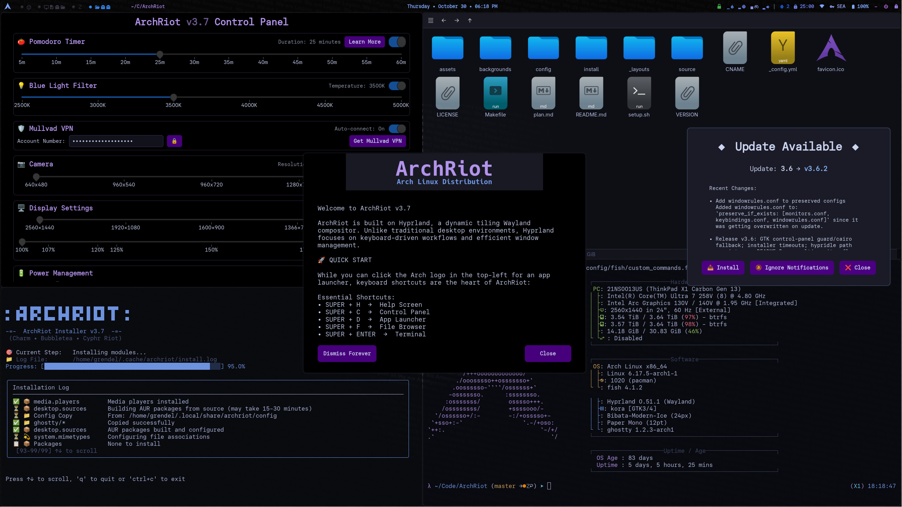

<div align="center">

# :: 𝔸𝕣𝕔𝕙ℝ𝕚𝕠𝕥 ::


</div>

## **ArchRiot: The (Arch) Linux System You've Always Wanted**

**One Command. Complete Environment. Zero Compromises.**

ArchRiot is the answer to every time you've thought "why can't Linux just work correctly from the start?" We've spent hundreds of hours perfecting the details so you get a blazing-fast, secure, beautiful system that actually respects your time and intelligence.

**Curated to be correct:**

- **🪟 Hyprland Tiling WM** - Makes other Window Managers feel primitive
- **⚡ Go Binary Installer** - Atomic operations, instant rollbacks, zero dependency hell
- **🛡️ Privacy by Design** - Zero telemetry, zero tracking, zero corporate data harvesting
- **🎨 CypherRiot Aesthetics** - Carefully crafted dark themes that work at any hour
- **💻 Development-First** - Zed, Neovim, shell enhancements, and other upgrades

_Built on Arch Linux with Hyprland, because compromises are for other people. This isn't maintained by committee or corporate roadmap -- it's maintained by someone with an obsessive, singular focus on getting it right the first time, because crappy Linux environments are an insult to what computing should be._



## 🚀 Choose Your ArchRiot Experience

### 🔥 Method 1: Install Script

**Transform your current Arch system into ArchRiot**

```bash
curl -fsSL https://ArchRiot.org/setup.sh | bash
```

**Perfect for:**

- 🏠 **System preservation** - Keep your data, configs, and custom tweaks intact
- 🔧 **Arch variants** - CachyOS, Manjaro, EndeavourOS, or pure Arch installations
- 🎨 **Desktop upgrade** - Transform just your desktop environment, leave the rest alone
- ⚡ **Quick wins** - Get ArchRiot's best features without starting over

**What you get:**

- ArchRiot desktop environment and apps
- Hyprland tiling window manager
- CypherRiot themes and customizations
- Keeps your existing system intact

#### **Note:** For fresh installations, we also have an **ArchRiot ISO available** (See below "Method 2")

### ⚡ Method 2: ArchRiot ISO

1. **📥 Download ArchRiot ISO**
    - **[Download ArchRiot 2025 ISO](https://github.com/CyphrRiot/ArchRiot/releases/download/v2.7.2/archriot-2025.iso)**
    - **[SHA256 Checksum](https://github.com/CyphrRiot/ArchRiot/releases/download/v2.7.2/archriot-2025.sha256)**

2. **💾 Download Ventoy**
    - Download [Ventoy](https://www.ventoy.net/) and create a bootable USB drive
    - _Pro tip: Ventoy lets you boot multiple ISOs from one USB - perfect for testing_

3. **📂 Copy ISO to Ventoy Drive**
    - Copy the ArchRiot ISO file directly to your Ventoy USB drive
    - No flashing needed - just copy the file

4. **⚡ Boot ArchRiot ISO**
    - Boot from USB (disable Secure Boot if your BIOS is being difficult)
    - Select ArchRiot ISO from Ventoy menu
    - Type `riot` and watch the magic happen

**Perfect for:**

- 🖥️ **Fresh hardware** - New builds, clean slates, virtual machines
- 🚀 **Instant gratification** - Boot → `riot` → Perfect desktop in minutes
- 💀 **System replacement** - When your current setup has disappointed you for the last time
- 🎯 **Zero configuration** - For people who have better things to do than tweak configs

**What you get:**

- Complete Arch Linux + ArchRiot system
- Boot ISO → Run `riot` → Complete guided setup
- Hyprland, themes, apps all pre-configured
- No manual setup required


---

## 📚 Navigate This Guide

**🚀 Getting Started:**

- [⌨️ Essential Commands](#️-master-your-archriot-desktop) - Master your new desktop in minutes
- [🎛️ Control Panel](#️-archriot-control-panel) - ArchRiot's powerful management interface
- [🎯 Key Customizations](#-key-customizations) - What makes ArchRiot special

**🎨 Customization & Themes:**

- [🎨 CypherRiot Theme System](#-cypherriot-theme-system) - Beautiful, cohesive aesthetics
- [📋 YAML Configuration](#understanding-the-yaml-configuration) - Under the hood architecture

**📊 System Info:**

- [⚡ ArchRiot At a Glance](#-archriot-at-a-glance) - Why ArchRiot flies
- [🔍 Installation Verification](#-installation-verification-system) - How we ensure quality
- [🛠️ Development Tools](#️-development-tools) - Build from source and contribute
- [📋 System Requirements](#-system-requirements) - What you need to run ArchRiot
- [🖥️ VM & Hardware Notes](#️-vm--hardware-notes) - Compatibility and hardware info
- [🔀 Differences from Omarchy](#-differences-from-omarchy) - Why ArchRiot is not Omarchy

**Security Note:** Your system remains secure through LUKS disk encryption and screen lock. Passwordless sudo is standard for automated system installations and doesn't compromise security when disk encryption is properly configured.

#### 🚀 One-Line Install or Upgrade

**The only command you need to remember:**

```bash
curl -fsSL https://ArchRiot.org/setup.sh | bash
```


This downloads and runs our bulletproof Go binary installer with intelligent YAML configuration. Upgrading is exactly the same command - because simplicity is the ultimate sophistication.

**What happens:** Automatic package installation, configuration deployment, and system setup with complete rollback capability if anything goes wrong.

## 🔧 Troubleshooting

### Blinking Cursor Instead of Hyprland

If your system boots to a **blinking cursor** instead of starting Hyprland:

1. **Get to a terminal:** Press `CTRL+ALT+F3`
2. **Login** with your username and password
3. **Re-run the installer** to fix GPU/graphics issues:
    ```bash
    curl -fsSL https://ArchRiot.org/setup.sh | bash
    ```
4. **Reboot** after the script completes

This issue is almost always GPU-related and the installer will detect and fix graphics driver problems automatically.

## ⌨️ Master Your ArchRiot Desktop

_The keyboard shortcuts that'll make you wonder how you ever used a mouse_

### 🎯 Getting Started

_Your gateway to ArchRiot mastery - memorize these first_

| Keybinding       | Action                                     |
| ---------------- | ------------------------------------------ |
| `SUPER + H`      | Show HELP - Your lifeline when lost        |
| `SUPER + D`      | App launcher - Find anything instantly     |
| `SUPER + RETURN` | Terminal - Your command center (Ghostty)   |
| `SUPER + L`      | Lock screen - Beautiful CypherRiot styling |
| `SUPER + ESCAPE` | Power menu - Sleep, restart, or shutdown   |

### 🪟 Window Management (Most Used)

_Tiling mastery - where ArchRiot really shines_

| Keybinding                   | Action                                          |
| ---------------------------- | ----------------------------------------------- |
| `SUPER + W` or `SUPER + Q`   | Close window - Goodbye forever                  |
| `SUPER + V`                  | Toggle floating - Break free                    |
| `SUPER + J`                  | Toggle split - Reorganize space                 |
| `SUPER + Arrow Keys`         | Move focus - Navigate like a pro                |
| `SUPER + SHIFT + Arrow Keys` | Swap windows - Rearrange perfection             |
| `SUPER + CTRL + Arrow Keys`  | Smart movement - Let Hyprland think             |
| `SUPER + SHIFT + TAB`        | Fix off-screen windows - Manual rescue tool     |
| `SUPER + 1-4`                | Switch workspace - Your digital rooms           |
| `SUPER + SHIFT + 1-4`        | Move window to workspace - Relocate             |
| `SUPER + SHIFT + RETURN`     | Floating terminal - When you need overlay power |

### 💻 Core Applications

_The tools that matter, one keystroke away_

| Keybinding               | Action                                                |
| ------------------------ | ----------------------------------------------------- |
| `SUPER + F`              | File manager - Navigate your digital kingdom (Thunar) |
| `SUPER + B`              | Browser - Privacy-focused web (Brave)                 |
| `SUPER + Z`              | Code editor - Modern development (Zed)                |
| `SUPER + N`              | Text editor - Power user paradise (Neovim)            |
| `SUPER + O`              | Simple text editor - Clean and fast (GNOME)           |
| `SUPER + T`              | System monitor - See everything (btop)                |
| `SUPER + SHIFT + RETURN` | Floating terminal - Overlay power mode                |

### 💬 Communication & Social

_Stay connected without selling your soul to data miners_

| Keybinding  | Action                                          |
| ----------- | ----------------------------------------------- |
| `SUPER + E` | Email - Encrypted and private (Proton Mail)     |
| `SUPER + G` | Signal messenger - NSA-proof conversations      |
| `SUPER + S` | Signal launcher - Smart Signal integration      |
| `SUPER + M` | Google Messages - When you must use the machine |
| `SUPER + X` | X/Twitter                                       |

### 📸 Screenshots & Recording

_Capture your ArchRiot greatness and share it with the world_

| Keybinding          | Action                                                  |
| ------------------- | ------------------------------------------------------- |
| `SUPER + SHIFT + S` | Region screenshot - Select exactly what matters         |
| `SUPER + SHIFT + W` | Window screenshot - Perfect app captures                |
| `SUPER + SHIFT + F` | Full screen - Show off your entire desktop              |
| `Kooha`             | Screen recorder - Make tutorials (launch via `SUPER+D`) |

### 🎨 Wallpaper Management & Dynamic Theming

_Keep your desktop fresh with ArchRiot's intelligent wallpaper system and automatic color theming_

| Keybinding             | Action                                    |
| ---------------------- | ----------------------------------------- |
| `SUPER + CTRL + SPACE` | Cycle backgrounds - Fresh vibes on demand |

**🌈 Dynamic Color Theming:**

- **Optional intelligent theming** - Enable in Control Panel to extract colors from your wallpaper
- **Real-time waybar updates** - When enabled, workspace colors, CPU indicators, and accents change instantly to match your wallpaper
- **Toggle control** - Enable/disable dynamic theming in the Control Panel or keep classic CypherRiot colors
- **Smart fallback** - Always reverts to beautiful CypherRiot theme when disabled
- **⚠️ Upgrade note** - System upgrades will reset dynamic theming to CypherRiot defaults (simply re-enable in Control Panel)

**🎛️ Control Panel Magic:**

- Launch ArchRiot Control Panel for drag-and-drop wallpaper management
- Dynamic theming toggle - Enable wallpaper-based colors or stick with CypherRiot classics
- System wallpapers (1-15) + your custom collection (U1, U2, etc.) perfectly organized
- Changes apply instantly - no restarts, no waiting, just beauty

**🖼️ Custom Wallpaper Power Moves:**

```bash
# Pro method: Use the Control Panel's file chooser
# Quick method: Drop files directly into ~/.config/archriot/backgrounds/

# Clean house - remove specific wallpaper
rm ~/.config/archriot/backgrounds/user_01.jpg

# Nuclear option - start fresh
rm ~/.config/archriot/backgrounds/*
```

### ⚙️ System Management

_Keep your ArchRiot system running like a well-oiled machine_

```bash
archriot                             # ArchRiot's intelligent installer/upgrade engine
                                     # Automatically detects if upgrade is needed
                                     # Prompts for confirmation before proceeding

migrate                              # Backup/restore wizard - your insurance policy
sudo systemctl reboot                # Fresh start - sometimes you need it
sudo systemctl poweroff              # Graceful shutdown - not a crash
```

### 🎵 Audio & Media

_Hardware media keys that actually work - imagine that!_

```bash
XF86AudioRaiseVolume                 # Volume up - with gorgeous overlay
XF86AudioLowerVolume                 # Volume down - smooth as silk
XF86AudioMute                        # Toggle mute - instant feedback
XF86AudioMicMute                     # Microphone toggle - privacy at a keystroke
XF86AudioPlay/Pause                  # Media control - works with everything

# Beautiful volume overlay appears instantly with progress bar
# These are your actual hardware keys working the way they should
```

### 📊 Waybar Controls (Status Bar)

_Your desktop's mission control - everything you need at a glance_

```bash
Click tomato timer                   # Pomodoro focus mode - stay productive
Double-click tomato timer            # Reset to 25:00 - fresh start
Click network icon                   # Network manager - connect anywhere
Click volume icon                    # Audio settings - fine-tune your sound
Click battery icon                   # Power management - stay charged
```

### 🔧 Emergency Fixes (When Things Go Sideways)

_Because sometimes even perfect systems need a gentle nudge_

```bash
curl -fsSL https://archriot.org/setup.sh | bash           # Upgrade - fixes everything
```

## 📋 Evolution Log

_The relentless march toward Linux perfection_

**🔥 Current Release:** v2.7.5 - Lock screen colors, image viewer improvements, and volume preservation

**🚀 Recent Milestones:**

- **v2.7.4:** DPMS wake fixes and system optimization
- **v2.7.3:** Enhanced theme consistency and bug fixes
- **v2.7.2:** Critical yay installation + dependency fixes
- **v2.7.1:** Hardware module path issue fixes
- **v2.7.0:** Bulletproof fail-fast error handling - because failure is not an option
- **v2.6.14:** Waybar 3-state + package safety restoration
- **v2.6.13:** Bulletproof setup.sh + Control Panel UX improvements

```bash
# View all version changes
git log --grep="FIX" --oneline
```

## 🎛️ ArchRiot Control Panel

**The command center that makes Linux actually user-friendly**

ArchRiot's Control Panel isn't just another settings app - it's the missing piece that makes advanced Linux features accessible to humans. Built with modern GTK4, it's fast, beautiful, and actually makes sense.

**Launch it:** `SUPER+C` or run `archriot-control-panel` from anywhere


### 🎛️ **Features**

- **🍅 Pomodoro Timer** - Waybar-integrated productivity timer with 5-60 minute intervals
- **💡 Blue Light Filter** - Real-time screen temperature control (2500K-5000K) via hyprsunset
- **🛡️ Mullvad VPN** - Account management with privacy controls and auto-connect
- **🔊 Audio System** - Safe mute/unmute controls without breaking services
- **📷 Camera Control** - Device permissions, resolution settings, and live preview testing
- **🖥️ Display Settings** - Monitor resolution and scaling with live preview
- **🔋 Power Management** - Battery profiles (Power Saver, Balanced, Performance)

### 🛡️ **Privacy & Safety**

- **Account Privacy** - Sensitive information hidden by default with show/hide toggle
- **Safe Controls** - Mute instead of killing services, permissions instead of breaking :
- **Live Preview** - Real-time system changes with "Exit without Saving" option
- **Educational Content** - "Learn More" dialogs with comprehensive feature explanations

### 🎨 **Technical Excellence**

_Because you deserve software that doesn't suck_

- **GTK4 Application** - Cutting-edge interface with gorgeous CypherRiot theming
- **Real-time Integration** - Watch changes happen instantly - no "apply" buttons needed
- **Bulletproof Persistence** - Your settings survive reboots, updates, and system chaos
- **Modular Architecture** - Built right from day one - extensible and maintainable

## 💾 **Built-in Backup & Recovery with Migrate**

**Your perfect ArchRiot setup is precious - protect it like the digital treasure it is**

ArchRiot automatically installs and integrates **[Migrate](https://github.com/CyphrRiot/Migrate)** - our battle-tested backup and recovery system. This isn't some afterthought tool - it's your insurance policy against hardware failures, user errors, and the inevitable "what did I just delete?" moments.

_Because spending weeks recreating your perfect setup is a special kind of hell._

### 🛡️ **Why Migrate Matters**

- **Complete System Backup** - Every dotfile, every tweak, every perfect configuration preserved
- **Interactive TUI** - Gorgeous terminal interface that makes complex operations simple
- **Live System Recovery** - Restore without nuking your system - keep working while fixing
- **Cross-Installation Migration** - Clone your setup to new machines in minutes
- **Zero Maintenance** - Updates automatically with ArchRiot - one less thing to worry about

### 🔥 **Quick Start**

```bash
migrate                              # Launch interactive backup/restore interface
```

**No flags, no complexity** - just run `migrate` and use the intuitive menu to backup or restore your entire ArchRiot setup in minutes!

[](https://github.com/CyphrRiot/Migrate)

## 🎯 Key Customizations

### 🔧 **Core System Changes**

- **Terminal:** Ghostty (replaces Kitty) with 90% transparency and dark theme
- **Browser:** Brave (replaces Chromium) with native Wayland support
- **File Manager:** Thunar (replaces Nautilus) with comprehensive dark theming
- **Shell:** Fish as default (replaces Bash) with proper PATH configuration
- **Theme:** CypherRiot integrated as unified theme system
- **Code Editor:** Zed (Wayland) + Neovim with proper theme integration
- **Applications:** All major apps now run native Wayland (no more XWayland issues)
- **Migrate Backup Tool:** CyphrRiot's comprehensive system backup/restore solution (built-in)
- **Memory Optimization:** Intelligent memory management that actually works
- **Blue Light Filter:** hyprsunset at 3500K for reduced eye strain (configurable)
- **GTK Theming:** Dark theme everywhere - no more jarring white dialogs
- **DPI Scaling:** Fixed scaling issues for consistent UI across all applications

#### 🧠 **Memory Management Fix**

Linux's default memory management is **aggressively stupid** about caching. The kernel will happily consume 90%+ of your RAM for file caches, then struggle to free it when applications actually need memory.

**ArchRiot's Solution:** Comprehensive memory management tuning that provides:

**Core Improvements:**

- **Smart Caching** - Reserves 1GB RAM, reduces aggressive file system caching
- **Minimal Swapping** - 10% swappiness (vs 60% default) keeps everything in RAM
- **Lag-Free Writing** - 5% dirty page limit prevents massive write bursts
- **Background Cleanup** - 2% background writeback for smooth performance

**Advanced Protection:**

- **Memory Overcommit Control** - Prevents dangerous memory allocation that causes crashes
- **Proactive Defragmentation** - Reduces memory fragmentation for better allocation
- **Smart OOM Killer** - Kills problematic processes, not random system services
- **Enhanced Responsiveness** - Optimized dirty page intervals and memory bandwidth

**Real-World Impact:**

- **No more lag spikes** when opening applications or switching windows
- **Better responsiveness** under heavy memory pressure (tested with 75%+ RAM usage)
- **Reduced swap usage** with intelligent RAM utilization
- **System stability** under extreme load - no freezes or crashes

**Result:** Your system stays fast and responsive even when running multiple applications, compiling code, or under extreme stress testing.

### 📱 **Advanced Waybar Integration**

ArchRiot includes a highly customized Waybar (status bar) with comprehensive system integration:

**Built-in Modules:**

- **🍅 Tomato Timer** - Built-in Pomodoro timer (idle/running/break/finished)
- **🛡️ Mullvad VPN Status** - Real-time VPN connection status with location display
- **📊 System Monitoring** - CPU aggregate usage, accurate memory monitoring
- **📊 Visual System Metrics** - Temperature, CPU, memory, and volume shown as intuitive bar indicators (▁ ▂ ▃ ▄ ▅ ▆ ▇ █)
- **🎤 Microphone Control** - Visual mic status with one-click toggle
- **📶 Network Management** - WiFi status with nmtui integration
- **🔊 Audio Controls** - Volume display with hardware key integration

**Technical Improvements:**

- **CSS Parser Fixed** - Eliminated all !important declarations causing waybar errors
- **Custom Separators** - Clean, organized module layout for better readability
- **Transparency System** - Consistent 90-98% opacity across all applications
- **Font Optimization** - Improved date format (Sunday • July 13 • 01:49 PM)
- **Error-free Operation** - All modules validated and tested for reliability

### 📱 **Clean Web Applications**

- **Proton Mail** (SUPER+E / XF86Mail) - Privacy-focused email in floating window
- **Signal** (SUPER+G) - Private messaging app
- **Google Messages** (SUPER+M) - Web-based messaging in floating window
- **X/Twitter** (SUPER+X) - Social platform in floating window
- **GitHub** - Development platform with proper icons from homarr-labs

### 🪟 **Responsive Window Management**

- **Percentage-based sizing** - Windows scale properly across different screen resolutions (1080p, 1440p, 4K, ultrawide)
- **Smart centering** - All floating windows automatically center regardless of monitor size
- **Cross-resolution compatibility** - No hardcoded pixel positions, works on any display setup
- **Optimized app windows**:
    - **X/Twitter**: `40% x 90%` (mobile-style layout with responsive height)
    - **Proton Mail**: `45% x 80%` (perfect email reading dimensions)
    - **Google Messages**: `40% x 85%` (comfortable messaging interface)
    - **Signal**: `40% x 80%` (maintains native desktop experience)
- **Future-proof design** - Window rules adapt automatically to new monitor configurations

### 🎮 **GPU Support**

ArchRiot automatically detects and installs optimal drivers for all major GPUs:

- **NVIDIA**: Proprietary drivers with Wayland and hardware acceleration
- **AMD/Radeon**: Open-source Mesa drivers with Vulkan support
- **Intel**: Mesa drivers including Intel Arc support

All GPUs get proper Wayland integration and hardware video acceleration for optimal performance.

**Performance Features:**

- **Hardware acceleration** - Video playback, compositing effects, and application rendering
- **Wayland native support** - No XWayland compatibility issues
- **Automatic driver selection** - No manual configuration required
- **Vulkan support** - Modern graphics API for gaming and development
- **Multi-monitor optimization** - Proper scaling and display management

### ⌨️ **Enhanced Keybindings & Productivity**

- **SUPER+D** = **SUPER+SPACE** (Unified app launcher)
- **Left-click Arch icon** - nwg-drawer app grid
- **Right-click Arch icon** - fuzzel app launcher
- **XF86Mail** - Floating Proton Mail window
- **SUPER+SHIFT+S** - Region screenshot (primary)
- **SUPER+SHIFT+W** - Window screenshot
- **SUPER+SHIFT+F** - Full screen screenshot
- **Key repeat enabled** (40 rate, 600 delay for responsive typing)
- **All media keys** - Volume, brightness, playback controls

### 🎨 **Document & Media Handling**

- **Gnome Text Editor** - Default for text/markdown files (clean, modern text editing with CypherRiot theme)
- **Papers** - Default PDF viewer (GNOME's modern document viewer)
- **MPV** - Video playback with optimal performance
- **Better waybar network** - nmtui instead of impala for reliable WiFi management
- **Screenshot tools** - grim/slurp/hyprshot integration for all capture needs
- **Screen recording** - Kooha for simple GUI-based screen recording

### 🚫 **Removed Bloat & Corporate Apps**

- **Removed 37signals/Basecamp tools** - Hey, Basecamp web apps
- **Removed corporate social** - Discord, proprietary messaging
- **Removed heavy productivity** - Obsidian, LibreOffice, OBS Studio, KDEnlive, Pinta
- **Removed proprietary services** - 1Password, Typora, Dropbox, Spotify, Zoom
- **Removed entertainment** - YouTube webapp, WhatsApp webapp

## 🔄 System Management

### Updates

**System Updates:**

```bash
sudo pacman -Syu                     # Standard Arch Linux system update
yay -Syu                             # Update AUR packages
```

**ArchRiot Updates:**

```bash
curl -fsSL https://archriot.org/setup.sh | bash    # Update ArchRiot (same as install)
```

**Automatic Update Notifications**: ArchRiot automatically checks for updates every 4 hours and shows a notification dialog when newer versions are available. You can install updates, ignore notifications, or simply close the dialog.

<div align="center">

<br><em>Waybar update notifications: 󰚰 (new), 󱧘 (seen), - (up-to-date) with one-click upgrade dialog</em>
</div>

The ArchRiot updater downloads the latest YAML configuration and pre-built binary, then intelligently applies only the changes needed. The YAML-based system ensures **atomic updates** with proper dependency resolution - no partial failures or broken states like traditional shell script updaters.

### Backup & Restore

```bash
migrate
```

**🎯 Migrate** is a separate project by Cypher Riot that gets automatically installed during ArchRiot setup. It's a TUI (Text User Interface) with **no command-line options**. Simply run the command and use the interactive menu to:

- Create comprehensive system backups
- Restore from previous backups
- Migrate configurations between installations
- Preserve all your customizations

**Integration Details:** ArchRiot automatically downloads and installs the latest version of Migrate from [CypherRiot/Migrate](https://github.com/CyphrRiot/Migrate) during installation, ensuring you always have the most current backup capabilities without any manual setup.

## 🎨 CypherRiot Theme System

There is one theme: **CypherRiot**, a beautiful Neo Tokyo Dark inspired theme. If you don't like it, the theme files are at `~/.local/share/archriot/config/` and can be edited.

**Visual Design:**

- **Style:** Custom Neo Tokyo Dark aesthetic with dark elegance
- **Color Palette:** Deep purples, electric blues, and charcoal backgrounds
- **Integration:** Complete system theming (waybar, hyprlock, fuzzel, terminals, applications)
- **Backgrounds:** 23 riot-themed wallpapers for dynamic cycling

**System Integration:**

- **Window Manager:** CypherRiot colors in Hyprland decorations and borders
- **Status Bar:** Custom waybar with CypherRiot purple accents and consistent styling
- **Lock Screen:** Beautiful hyprlock with CypherRiot theme and system status
- **Applications:** Unified theming across GTK, terminal, and desktop applications

### Wallpaper Management

- **Instant application:** Background changes apply immediately
- **Persistent settings:** Background preferences survive reboots and updates

**Background System:**

- **CypherRiot collection:** 23 riot-themed wallpapers included
- **Easy cycling:** Use `SUPER + CTRL + SPACE` to cycle through backgrounds
- **Dynamic switching:** Script-based background rotation for variety
- **High quality:** Curated wallpapers optimized for the CypherRiot aesthetic

**Advanced Customization:**

- **Background location:** `~/.local/share/archriot/backgrounds/` (consolidated directory)
- **Custom backgrounds:** Add your own wallpapers to the backgrounds directory
- **Script integration:** Background cycling integrates with waybar and system status
- **Application consistency:** CypherRiot theme provides unified styling across all applications

## Understanding the YAML Configuration

**For developers and power users who want to customize the system before installation:**

```bash
git clone https://github.com/CyphrRiot/ArchRiot.git ~/.local/share/archriot
# Edit install/packages.yaml to customize
~/.local/share/archriot/install/archriot
```

### YAML Architecture

ArchRiot uses a modern YAML-based configuration system that replaces traditional shell scripts. The entire system is defined in `install/packages.yaml`, which contains:

**Structure:**

- **Categories** (core, desktop, development, system, media)
- **Modules** within each category (base, hyprland, tools, etc.)
- **Each module defines:**
    - `packages:` - List of packages to install
    - `configs:` - Configuration files to deploy with patterns and targets
    - `commands:` - Post-installation commands to run
    - `depends:` - Dependencies on other modules
    - `type:` - Installation type (pacman, yay, flatpak, etc.)

**Example module:**

```yaml
desktop:
    hyprland:
        packages: [hyprland, waybar, wofi, hyprpaper]
        configs:
            - pattern: "config/hypr/*"
              target: "~/.config/hypr/"
              preserve_if_exists: [monitors.conf]
            - pattern: "config/waybar/*"
              target: "~/.config/waybar/"
        commands: ["systemctl --user enable hyprland"]
        depends: [core.base]
        type: pacman
```

This YAML system provides clean separation of packages, configurations, and commands while maintaining full dependency resolution and proper installation ordering.

### Configuration Preservation

ArchRiot includes an intelligent preservation system via `install/preserve.yaml` that maintains your personal customizations during upgrades and reinstalls. This ensures your keyboard layout, application preferences, and other settings survive system updates.

**Preserved Settings:**

- **Keyboard Configuration** - Layout (us, fr, de), variant, and model
- **Default Applications** - Browser, terminal, file manager, and dock preferences
- **User Customizations** - Any settings you've modified in Hyprland configs

**How It Works:**

1. **Detection** - Scans existing configs for user-customizable settings
2. **Backup** - Creates timestamped backups in `~/.cache/archriot/`
3. **Extraction** - Pulls out your personal settings using defined patterns
4. **Restoration** - Optionally applies saved settings to new configs

**Example preserve.yaml entry:**

```yaml
user_customizable_settings:
    - name: "kb_layout"
      description: "Keyboard layout (us, fr, de, etc.)"
      pattern: "kb_layout"

    - name: "browser"
      description: "Default browser application"
      pattern: "$browser"
```

The system prompts during installation: **"Restore your hyprland modifications?"** allowing you to choose whether to apply your saved preferences to the fresh configuration.

## ⚡ ArchRiot At a Glance

_The elevator pitch - everything that makes ArchRiot special in one place_

**🪟 Wayland Excellence:** Hyprland compositor with smooth animations, intelligent tiling, and zero XWayland compromises

**💻 Developer Paradise:** Fish shell, Zed editor, Neovim, modern CLI tools (lsd, ripgrep), and containers that just work

**🛡️ Privacy Arsenal:** Brave browser, Proton Mail, Mullvad VPN, Signal messaging, and Feather Wallet - all with native Wayland support

**🎨 Visual Perfection:** CypherRiot dark themes, optional blue light filtering, and beautiful interfaces that don't hurt your eyes at 3AM

**⚡ Performance Tuned:** Intelligent memory management, hardware acceleration, and optimized audio stack for lag-free computing

## 🔀 Differences from Omarchy

ArchRiot was (once) a **heavily customized fork** with these key distinctions:

### Core Philosophy

- **Privacy-first approach** - Proton Mail, Brave browser, Signal messaging vs. corporate alternatives
- **Developer-focused** - Zed editor, modern CLI tools, Fish shell, comprehensive dev environment
- **Performance over bloat** - Lightweight applications, intelligent memory management, native Wayland
- **Clean aesthetics** - CypherRiot theme, consistent dark mode, minimal distractions

### Major Technical Differences

- **Built-in backup system** - Integrated Migrate tool for complete system backup/restore
- **Enhanced window management** - Responsive percentage-based sizing across all resolutions
- **Comprehensive GPU support** - Automatic detection and optimization for NVIDIA, AMD, Intel
- **Advanced Waybar integration** - Custom modules, Pomodoro timer, VPN status, system monitoring
- **Modern application stack** - Ghostty terminal, Brave browser, native Wayland applications
- **Intelligent system tuning** - Memory management fixes, blue light filtering, DPI scaling

ArchRiot transforms Omarchy from a general productivity setup into a specialized development and privacy-focused environment.

## 🔍 Installation Verification System

ArchRiot includes a comprehensive verification system to ensure everything is working correctly:

### What the Installer Actually Does

The ArchRiot installer validates everything automatically as it runs. You don't need separate validation because the installer IS the validation system:

**Real-time validation during installation:**

- YAML configuration integrity and module dependencies
- Essential packages (yay, git, base-devel)
- Desktop environment (Hyprland, Waybar, fuzzel, mako)
- Configuration file deployment verification
- Applications (terminal, file manager, browser, text editor)
- System services (audio, network, bluetooth)
- Network connectivity and repository accessibility
- Memory, disk space, and system requirements

**If anything fails:** The installer stops immediately with clear error messages and diagnostic information. Fix the issue and re-run - it's completely safe and idempotent.

- **Detailed failure analysis** with specific recommendations
- **Fix suggestions** for failed components

### Verification

Installation logs are in `~/.cache/archriot/install.log` and can be reviewed for the full installation details or any errors during the installation process.

### Expected Defaults

After fresh installation, you should see:

- **Default theme:** CypherRiot (Neo Tokyo Dark aesthetic)
- **Default background:** riot_zero.png (riot-themed wallpaper)
- **PDF files:** Show proper document icons (not thumbnails)
- **Image files:** Show thumbnail previews in Thunar
- **Waybar:** Running with tomato timer, system stats, and transparent microphone button

## 🛠️ Development Tools

_For contributors and power users who want to build from source_

```bash
# Build ArchRiot from source (in repo directory)
make                                 # Build the Go binary
make test                            # Run test suite
make dev                             # Development build

# Version checking
cat ~/.local/share/archriot/VERSION  # Show installed ArchRiot version
```

## 📂 Repository Information

- **Main Repository:** [https://github.com/CyphrRiot/ArchRiot](https://github.com/CyphrRiot/ArchRiot)
- **Maintenance:** Active, with regular updates and improvements
- **Community:** Open to issues, suggestions, and contributions

## 🌐 Connect with CyphrRiot

<div align="center">

**Stay connected for updates, tips, and Linux excellence**

[](https://x.com/CyphrRiot)
[](https://github.com/CyphrRiot)

_Building the Linux system you actually want to use_

</div>

## 📋 System Requirements

- **Fresh Arch Linux installation** (recommended)
- **Internet connection** for package downloads
- **4GB+ RAM** (8GB+ recommended for development)
- **8GB+ storage** (10GB+ for full development setup)
- **CPU:** Any modern processor (optimized for both Intel/AMD)
- **GPU:** Any modern graphics card (see GPU Support section for full compatibility details)

_Note: ArchRiot began as a unique rice[^1] and evolved from [DHH's Omarchy](https://omarchy.org/) installer, but has since become a completely distinct Linux distribution based on Arch. It features a custom installer, advanced Go-based package management system, and many custom applications and tools focused on privacy, development productivity, and clean aesthetics._

[^1]: In the context of Linux, "rice" is slang for customizing or tweaking a desktop environment or user interface to make it look aesthetically pleasing or highly personalized, often with a focus on minimalism, unique themes, or lightweight setups. It comes from the term "ricer," originally used in car culture to describe heavily modified cars (inspired by "rice burner" for Japanese cars).

## 🖥️ VM & Hardware Notes

**ArchRiot is designed for bare metal hardware.** While it works perfectly in VMs, you're missing the full experience. This system is built to replace whatever disappointing Linux distribution you're currently stuck with. Install it on real hardware where it belongs.

**For VM testing:**

- **VirtualBox/VMware:** Works out of the box with the ArchRiot ISO
- **QEMU/KVM:** Full acceleration support with virtio drivers
- **Recommended VM specs:** 4GB+ RAM, 20GB+ storage, EFI boot enabled

**Hardware compatibility:**

- **Multi-GPU systems:** Automatic detection and driver installation
- **High-DPI displays:** Proper scaling across all applications
- **Gaming hardware:** Full support for NVIDIA/AMD/Intel graphics
- **Modern laptops:** Battery management, backlight control, and power profiles

**You're done!** If the installer finished, your ArchRiot system is ready to rock. Reboot and enjoy your perfectly configured desktop.

**Something not working?** Re-run the installer - it's designed to fix problems and maintain your system.

🎉 Thank you [Vaxryy](https://x.com/vaxryy) for creating Hyprland—the compositor that doesn't suck.

## 📄 License

ArchRiot is released under the [MIT License](https://opensource.org/licenses/MIT), enabling community contributions and modifications.

# 🛡️⚔️🪐 Hack the Planet 🪐⚔️🛡️
