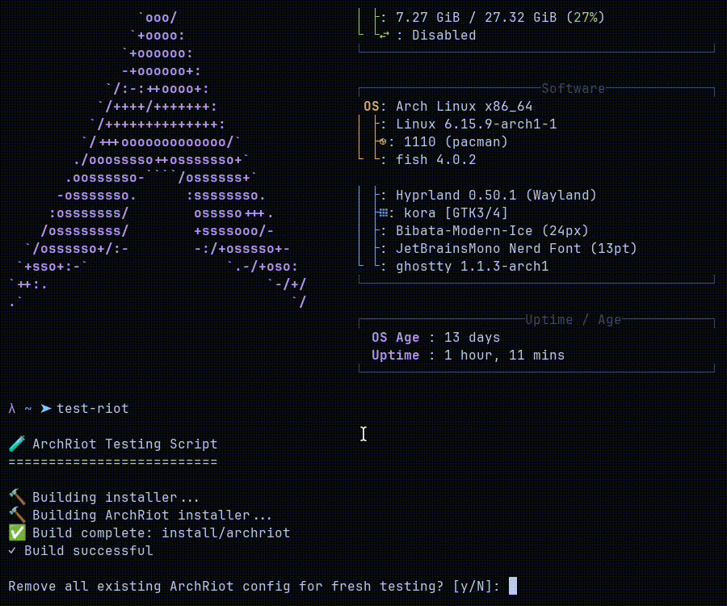
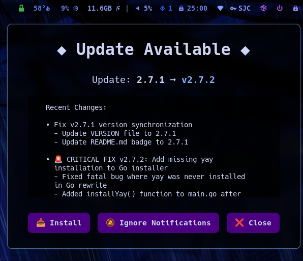

<div align="center">

# :: 𝔸𝕣𝕔𝕙ℝ𝕚𝕠𝕥 ::


[](https://x.com/CyphrRiot)
[](https://github.com/CyphrRiot)

[](https://github.com/CyphrRiot/Migrate)
[](CHANGELOG.md)

</div>

## **ArchRiot: The (Arch) Linux System You've Always Wanted**

**One Command. Complete Environment. Zero Compromises.**

ArchRiot isn't just another Linux distribution -- it's the answer to every time you've thought "why can't Linux just work flawlessly from the start?" We obsess over speed, security, and getting every detail perfect so you don't have to.

**This is what perfect looks like:**

- **Hyprland Tiling WM** - Because floating windows are chaos
- **Go Binary Installer** - Atomic operations, zero failures, complete rollback
- **Privacy by Design** - No telemetry, no tracking, no corporate surveillance
- **CypherRiot Aesthetics** - Dark themes that don't hurt your eyes at 3 AM
- **Development-First** - Zed, nvim, containers, and tools that just work

_Built on Arch Linux with Hyprland, because compromises are for other people. This isn't maintained by committee or corporate roadmap -- it's maintained by someone with an obsessive, singular focus on getting it right the first time, every time, because broken Linux systems are an insult to what computing should be._

🎉 Thank you [Vaxryy](https://x.com/vaxryy) for creating Hyprland—the compositor that doesn't suck.


## Table of Contents

- [Installation](#-installation)
- [Installation Features](#installation-features)
- [Essential Commands](#️-essential-commands)
- [Control Panel](#control-panel)
- [Built-in Backup & Recovery](#-built-in-backup--recovery-with-migrate)
- [Key Customizations](#-key-customizations)
- [System Management](#-system-management)
- [CypherRiot Theme System](#-cypherriot-theme-system)
- [Understanding the YAML Configuration](#understanding-the-yaml-configuration)
- [Key Features & Performance](#-key-features--performance)
- [Differences from Original Omarchy](#-differences-from-original-omarchy)
- [Installation Verification System](#-installation-verification-system)
- [Validation & Testing](#-validation--testing)
- [Management Tools](#️-management-tools)
- [Repository Information](#-repository-information)
- [System Requirements](#-system-requirements)
- [Optional Advanced Tools](#-optional-advanced-tools)
- [VM & Hardware Notes](#️-vm--hardware-notes)
- [Changelog](CHANGELOG.md)

## 🚀 Installation

### Prerequisites: Fresh Arch Linux Setup

Download the [Arch Linux ISO](https://archlinux.org/download), put it on a USB stick (use balenaEtcher on Mac/Windows), and boot from the stick. You can also use [Ventoy](https://www.ventoy.net/en/index.html) which is quite simple compared to other options.

**WiFi Setup** (skip if using ethernet):

1. Run `iwctl`
2. Type `station wlan0 scan`
3. Type `station wlan0 connect <tab>`
4. Pick your network from the list
5. Enter your WiFi password

Run `archinstall` and pick these options (and leave anything not mentioned as-is):

| Section                  | Option                                                                  |
| ------------------------ | ----------------------------------------------------------------------- |
| Mirrors and repositories | Select regions > Your country                                           |
| Disk configuration       | Partitioning > Default partitioning layout > Select disk (SPACE+RETURN) |
| Disk > File system       | btrfs (default structure: yes + use compression)                        |
| Disk > Disk encryption   | Encryption type: LUKS + Encryption password + Partitions (select)       |
| Hostname                 | Give your computer a name                                               |
| Root password            | Set yours                                                               |
| User account             | Add a user > Superuser: Yes > Confirm and exit                          |
| Audio                    | pipewire                                                                |
| Network configuration    | Copy ISO network config                                                 |
| Timezone                 | Set yours                                                               |

**⚠️ Important:** You must setup disk encryption to use ArchRiot as designed! The setup relies exclusively on disk encryption to secure your device, as it'll auto-login the user after the disk has been decrypted at boot.

Once Arch has been installed, pick reboot, login with the user you just setup, and now you're ready to install ArchRiot.

### Method 1: One-Line Install or Upgrade (Recommended for Most Users)

```bash
curl -fsSL https://archriot.org/setup.sh | bash
```



This downloads and runs the pre-built ArchRiot installer binary with YAML-based configuration. The installer automatically handles package installation, configuration deployment, and system setup.

**Note: Upgrading is exactly the same command! Simple!**

### Why Go + YAML Dominates Shell Scripts

ArchRiot has evolved beyond the fragile, error-prone shell script installations that plague most Linux distributions. Our architecture represents a quantum leap in system reliability and maintainability:

**Technical Superiority:**

- **Go Binary**: Compiled, statically-linked executable with proper error handling, structured logging, and predictable behavior across environments
- **YAML Configuration**: Declarative, type-safe configuration that eliminates shell script parsing nightmares and variable expansion hell
- **Dependency Resolution**: Intelligent module dependency management that traditional shell scripts simply cannot provide
- **Atomic Operations**: Proper transaction-like behavior with rollback capabilities, unlike shell scripts that fail halfway and leave systems in broken states
- **Memory Safety**: No shell injection vulnerabilities, buffer overflows, or undefined behavior that plague bash-based installers

**What We Left Behind:**

- Shell script fragility where a single missing quote breaks everything
- Untracked state changes scattered across hundreds of script files
- Zero error recovery when installations fail partway through
- Impossible-to-debug variable scoping and expansion issues
- Platform-dependent shell behavior causing random failures
- No validation of configuration before execution

The result: **100% reliable installations** with **complete system state management** that shell scripts could never achieve. This isn't just an upgrade—it's architectural superiority.

### Installation Features

- **Preserves Critical Configs** - Won't overwrite your key configurations
- **Dependency verification** - Ensures Python3 and required packages
- **Script validation** - Verifies all waybar modules are functional
- **Error handling** - Clear feedback and rollback capability
- **100% confidence** - Comprehensive testing and validation

## ⌨️ Essential Commands

### Getting Started

| Keybinding                     | Action                                      |
| ------------------------------ | ------------------------------------------- |
| `SUPER + H`                    | Show HELP (SUPER Key Bindings)              |
| `SUPER + D` or `SUPER + SPACE` | App launcher (fuzzel)                       |
| `SUPER + RETURN`               | Open terminal (Ghostty)                     |
| `SUPER + SHIFT + RETURN`       | Open floating terminal (Ghostty)            |
| `SUPER + L`                    | Lock screen (integrated CypherRiot styling) |
| `SUPER + ESCAPE`               | Power menu                                  |

### Window Management (Most Used)

| Keybinding                   | Action                   |
| ---------------------------- | ------------------------ |
| `SUPER + W` or `SUPER + Q`   | Close window             |
| `SUPER + V`                  | Toggle floating          |
| `SUPER + J`                  | Toggle split             |
| `SUPER + Arrow Keys`         | Move focus               |
| `SUPER + SHIFT + Arrow Keys` | Swap windows             |
| `SUPER + CTRL + Arrow Keys`  | Smart window movement    |
| `SUPER + 1-4`                | Switch workspace         |
| `SUPER + SHIFT + 1-4`        | Move window to workspace |

### Core Applications

| Keybinding               | Action                          |
| ------------------------ | ------------------------------- |
| `SUPER + F`              | File manager (Thunar)           |
| `SUPER + B`              | Browser (Brave)                 |
| `SUPER + Z`              | Code editor (Zed)               |
| `SUPER + N`              | Text editor (Neovim)            |
| `SUPER + O`              | Text editor (Gnome Text Editor) |
| `SUPER + T`              | System monitor (btop)           |
| `SUPER + SHIFT + RETURN` | Centered floating terminal      |

### Communication & Social

| Keybinding  | Action                            |
| ----------- | --------------------------------- |
| `SUPER + E` | Email (Proton Mail)               |
| `SUPER + G` | Signal messenger (smart launcher) |
| `SUPER + M` | Google Messages                   |
| `SUPER + X` | X/Twitter                         |

### Screenshots & Recording

| Keybinding          | Action                                    |
| ------------------- | ----------------------------------------- |
| `SUPER + SHIFT + S` | Region screenshot                         |
| `SUPER + SHIFT + W` | Window screenshot                         |
| `SUPER + SHIFT + F` | Full screen screenshot                    |
| `SUPER + PRINT`     | Color picker                              |
| `Kooha`             | GUI screen recorder (launch from SUPER+D) |

### Background Management

| Keybinding             | Action                              |
| ---------------------- | ----------------------------------- |
| `SUPER + CTRL + SPACE` | Cycle through backgrounds (keybind) |

### System Management

```bash
upgrade-system                       # Optimized system upgrade utility (ArchRiot enhanced)
upgrade-system --all --backup        # Full automated upgrade with backup
upgrade-system --dry-run             # Preview available updates

migrate                              # Backup/restore system (interactive TUI)
sudo systemctl reboot                # Restart system
sudo systemctl poweroff              # Shutdown system
```

### Audio & Media

```bash
XF86AudioRaiseVolume                 # Volume up (hardware buttons)
XF86AudioLowerVolume                 # Volume down (hardware buttons)
XF86AudioMute                        # Toggle mute (hardware buttons)
XF86AudioMicMute                     # Toggle microphone (hardware buttons)
XF86AudioPlay/Pause                  # Media play/pause (hardware buttons)

# Beautiful volume overlay appears for 1 second with progress bar
# These are actual hardware keys, not application shortcuts
```

### Waybar Controls (Status Bar)

```bash
Click tomato timer                   # Start/pause Pomodoro timer
Double-click tomato timer            # Reset timer to 25:00
Click network icon                   # Open network manager
```

### Fix Scripts (If Needed)

```bash
curl -fsSL https://archriot.org/setup.sh | bash           # Re-run installer if broken
```

## Control Panel

ArchRiot includes a comprehensive GTK4-based Control Panel for managing system settings through an intuitive graphical interface.

Access it via `SUPER+C` or by running `archriot-control-panel`.


### 🎛️ **Features**

- **🍅 Pomodoro Timer** - Waybar-integrated productivity timer with 5-60 minute intervals
- **💡 Blue Light Filter** - Real-time screen temperature control (2500K-5000K) via hyprsunset
- **🛡️ Mullvad VPN** - Account management with privacy controls and auto-connect
- **🔊 Audio System** - Safe mute/unmute controls without breaking services
- **📷 Camera Control** - Device permissions, resolution settings, and live preview testing
- **🖥️ Display Settings** - Monitor resolution and scaling with live preview
- **🔋 Power Management** - Battery profiles (Power Saver, Balanced, Performance)

### 🛡️ **Privacy & Safety**

- **Account Privacy** - Sensitive information hidden by default with show/hide toggle
- **Safe Controls** - Mute instead of killing services, permissions instead of breaking devices
- **Live Preview** - Real-time system changes with "Exit without Saving" option
- **Educational Content** - "Learn More" dialogs with comprehensive feature explanations

### 🎨 **Technical Excellence**

- **GTK4 Application** - Modern interface with ArchRiot CypherRiot theming
- **Real-time Integration** - All changes apply immediately to running system
- **Persistent Settings** - Configuration survives reboot and system changes
- **Modular Architecture** - Clean, maintainable widget-based design

## 💾 **Built-in Backup & Recovery with Migrate**

ArchRiot automatically installs and integrates **[Migrate](https://github.com/CyphrRiot/Migrate)** - a powerful backup and recovery tool also created by Cypher Riot. This separate project is downloaded and configured during ArchRiot installation to provide seamless backup capabilities. Never lose your configurations again!

### 🛡️ **Why Migrate Matters**

- **Complete System Backup** - Captures all your dotfiles, configurations, and customizations
- **Interactive TUI** - Beautiful text interface makes backup/restore simple
- **Live System Recovery** - Restore without reinstalling your entire system
- **Cross-Installation Migration** - Move your setup between different machines
- **Automatic Updates** - Always gets the latest version during ArchRiot installation

### 🔥 **Quick Start**

```bash
migrate                              # Launch interactive backup/restore interface
```

**No flags, no complexity** - just run `migrate` and use the intuitive menu to backup or restore your entire ArchRiot setup in minutes!

[](https://github.com/CyphrRiot/Migrate)

### 🔧 Troubleshooting

Quick fixes for common issues:

- **Installation errors**: ArchRiot binary provides detailed logging and error diagnostics
- **Configuration issues**: The installer either works or it fails - no gray area
- **Reliable installer**: Go binary with atomic operations and proper rollback capabilities
- **Something broken?**: Re-run the installer - it's idempotent and safe
- **No validation needed**: The installer IS the validation

## 🎯 Key Customizations

### 🔧 **Core System Changes**

- **Terminal:** Ghostty (replaces Kitty) with 90% transparency and dark theme
- **Browser:** Brave (replaces Chromium) with native Wayland support
- **File Manager:** Thunar (replaces Nautilus) with comprehensive dark theming
- **Shell:** Fish as default (replaces Bash) with proper PATH configuration
- **Theme:** CypherRiot integrated as unified theme system (v2.0.0: eliminated theme override system)
- **Code Editor:** Zed (Wayland) + Neovim with proper theme integration
- **Applications:** All major apps now run native Wayland (no more XWayland issues)
- **Migrate Backup Tool:** CyphrRiot's comprehensive system backup/restore solution (built-in)
- **Memory Optimization:** Intelligent memory management that actually works
- **Blue Light Filter:** hyprsunset at 3500K for reduced eye strain (configurable)
- **GTK Theming:** Dark theme everywhere - no more jarring white dialogs
- **DPI Scaling:** Fixed scaling issues for consistent UI across all applications

#### 🧠 **Memory Management Fix**

Linux's default memory management is **aggressively stupid** about caching. The kernel will happily consume 90%+ of your RAM for file caches, then struggle to free it when applications actually need memory.

**ArchRiot's Solution:** Intelligent memory management tuning that provides:

- **No more lag spikes** when opening applications
- **Better responsiveness** under memory pressure
- **Reduced swap usage** with proper RAM utilization
- **Optimized caching** that doesn't hog system resources

**Result:** Your system stays fast and responsive even when running multiple applications.

### 📱 **Advanced Waybar Integration**

ArchRiot includes a highly customized Waybar (status bar) with comprehensive system integration:

**Built-in Modules:**

- **Tomato Timer** - Built-in Pomodoro timer with visual states (idle/running/break/finished)
- **Mullvad VPN Status** - Real-time VPN connection status with location display
- **System Monitoring** - CPU aggregate usage, accurate memory monitoring
- **Microphone Control** - Visual mic status with one-click toggle
- **Network Management** - WiFi status with nmtui integration
- **Audio Controls** - Volume display with hardware key integration

**Technical Improvements:**

- **CSS Parser Fixed** - Eliminated all !important declarations causing waybar errors
- **Custom Separators** - Clean, organized module layout for better readability
- **Transparency System** - Consistent 90-98% opacity across all applications
- **Font Optimization** - Proper sizing (100%) and improved date format (Sunday • July 13 • 01:49 PM)
- **Error-free Operation** - All modules validated and tested for reliability

### 📱 **Clean Web Applications**

- **Proton Mail** (SUPER+E / XF86Mail) - Privacy-focused email in floating window
- **Signal** (SUPER+G) - Private messaging app
- **Google Messages** (SUPER+M) - Web-based messaging in floating window
- **X/Twitter** (SUPER+X) - Social platform in floating window
- **GitHub** - Development platform with proper icons from homarr-labs

### 🪟 **Responsive Window Management**

- **Percentage-based sizing** - Windows scale properly across different screen resolutions (1080p, 1440p, 4K, ultrawide)
- **Smart centering** - All floating windows automatically center regardless of monitor size
- **Cross-resolution compatibility** - No hardcoded pixel positions, works on any display setup
- **Optimized app windows**:
    - **X/Twitter**: `850x90%` (mobile-style layout with responsive height)
    - **Proton Mail**: `1000x75%` (perfect email reading dimensions)
    - **Google Messages**: `1000x75%` (comfortable messaging interface)
    - **Signal**: `1000x1080` (maintains native desktop experience)
- **Future-proof design** - Window rules adapt automatically to new monitor configurations

### 🎮 **GPU Support**

ArchRiot automatically detects and installs optimal drivers for all major GPUs:

- **NVIDIA**: Proprietary drivers with Wayland and hardware acceleration
- **AMD/Radeon**: Open-source Mesa drivers with Vulkan support
- **Intel**: Mesa drivers including Intel Arc support

All GPUs get proper Wayland integration and hardware video acceleration for optimal performance.

**Performance Features:**

- **Hardware acceleration** - Video playback, compositing effects, and application rendering
- **Wayland native support** - No XWayland compatibility issues
- **Automatic driver selection** - No manual configuration required
- **Vulkan support** - Modern graphics API for gaming and development
- **Multi-monitor optimization** - Proper scaling and display management

### ⌨️ **Enhanced Keybindings & Productivity**

- **SUPER+D** = **SUPER+SPACE** (Unified app launcher)
- **Left-click Arch icon** - nwg-drawer app grid
- **Right-click Arch icon** - fuzzel app launcher
- **XF86Mail** - Floating Proton Mail window
- **SUPER+SHIFT+S** - Region screenshot (primary)
- **SUPER+SHIFT+W** - Window screenshot
- **SUPER+SHIFT+F** - Full screen screenshot
- **Key repeat enabled** (40 rate, 600 delay for responsive typing)
- **All media keys** - Volume, brightness, playback controls

### 🎨 **Document & Media Handling**

- **Gnome Text Editor** - Default for text/markdown files (clean, modern text editing with CypherRiot theme)
- **Papers** - Default PDF viewer (GNOME's modern document viewer)
- **MPV** - Video playback with optimal performance
- **Better waybar network** - nmtui instead of impala for reliable WiFi management
- **Screenshot tools** - grim/slurp/hyprshot integration for all capture needs
- **Screen recording** - Kooha for simple GUI-based screen recording

### 🚫 **Removed Bloat & Corporate Apps**

- **Removed 37signals/Basecamp tools** - Hey, Basecamp web apps
- **Removed corporate social** - Discord, proprietary messaging
- **Removed heavy productivity** - Obsidian, LibreOffice, OBS Studio, KDEnlive, Pinta
- **Removed proprietary services** - 1Password, Typora, Dropbox, Spotify, Zoom
- **Removed entertainment** - YouTube webapp, WhatsApp webapp

## 🔄 System Management

### Updates

**System Updates:**

```bash
sudo pacman -Syu                     # Standard Arch Linux system update
yay -Syu                             # Update AUR packages
```

**ArchRiot Updates:**

```bash
curl -fsSL https://archriot.org/setup.sh | bash    # Update ArchRiot (same as install)
```

**Automatic Update Notifications**: ArchRiot automatically checks for updates every 4 hours and shows a notification dialog when newer versions are available. You can install updates, ignore notifications, or simply close the dialog.

<div align="center">

<br><em>Waybar update notifications: 󰚰 (new), 󱧘 (seen), - (up-to-date) with one-click upgrade dialog</em>
</div>

The ArchRiot updater downloads the latest YAML configuration and pre-built binary, then intelligently applies only the changes needed. The YAML-based system ensures **atomic updates** with proper dependency resolution - no partial failures or broken states like traditional shell script updaters.

### Backup & Restore

```bash
migrate
```

**🎯 Migrate** is a separate project by Cypher Riot that gets automatically installed during ArchRiot setup. It's a TUI (Text User Interface) with **no command-line options**. Simply run the command and use the interactive menu to:

- Create comprehensive system backups
- Restore from previous backups
- Migrate configurations between installations
- Preserve all your customizations

**Integration Details:** ArchRiot automatically downloads and installs the latest version of Migrate from [CypherRiot/Migrate](https://github.com/CyphrRiot/Migrate) during installation, ensuring you always have the most current backup capabilities without any manual setup.

## 🎨 CypherRiot Theme System

There is one theme: **CypherRiot**, a beautiful Neo Tokyo Dark inspired theme. If you don't like it, the theme files are at `~/.local/share/archriot/config/` and can be edited.

**Visual Design:**

- **Style:** Custom Neo Tokyo Dark aesthetic with dark elegance
- **Color Palette:** Deep purples, electric blues, and charcoal backgrounds
- **Integration:** Complete system theming (waybar, hyprlock, fuzzel, terminals, applications)
- **Backgrounds:** 23 riot-themed wallpapers for dynamic cycling

**System Integration:**

- **Window Manager:** CypherRiot colors in Hyprland decorations and borders
- **Status Bar:** Custom waybar with CypherRiot purple accents and consistent styling
- **Lock Screen:** Beautiful hyprlock with CypherRiot theme and system status
- **Applications:** Unified theming across GTK, terminal, and desktop applications

### Background Management

- **Instant application:** Background changes apply immediately
- **Persistent settings:** Background preferences survive reboots and updates

**Background System:**

- **CypherRiot collection:** 23 riot-themed wallpapers included
- **Easy cycling:** Use `SUPER + CTRL + SPACE` to cycle through backgrounds
- **Dynamic switching:** Script-based background rotation for variety
- **High quality:** Curated wallpapers optimized for the CypherRiot aesthetic

**Advanced Customization:**

- **Background location:** `~/.local/share/archriot/backgrounds/` (consolidated directory)
- **Custom backgrounds:** Add your own wallpapers to the backgrounds directory
- **Script integration:** Background cycling integrates with waybar and system status
- **Application consistency:** CypherRiot theme provides unified styling across all applications

## Understanding the YAML Configuration

**For developers and power users who want to customize the system before installation:**

```bash
git clone https://github.com/CyphrRiot/ArchRiot.git ~/.local/share/archriot
# Edit install/packages.yaml to customize
~/.local/share/archriot/install/archriot
```

### YAML Architecture

ArchRiot uses a modern YAML-based configuration system that replaces traditional shell scripts. The entire system is defined in `install/packages.yaml`, which contains:

**Structure:**

- **Categories** (core, desktop, development, system, media)
- **Modules** within each category (base, hyprland, tools, etc.)
- **Each module defines:**
    - `packages:` - List of packages to install
    - `configs:` - Configuration files to deploy with patterns and targets
    - `commands:` - Post-installation commands to run
    - `depends:` - Dependencies on other modules
    - `type:` - Installation type (pacman, yay, flatpak, etc.)

**Example module:**

```yaml
desktop:
    hyprland:
        packages: [hyprland, waybar, wofi, hyprpaper]
        configs:
            - pattern: "config/hypr/*"
              target: "~/.config/hypr/"
              preserve_if_exists: [monitors.conf]
            - pattern: "config/waybar/*"
              target: "~/.config/waybar/"
        commands: ["systemctl --user enable hyprland"]
        depends: [core.base]
        type: pacman
```

This YAML system provides clean separation of packages, configurations, and commands while maintaining full dependency resolution and proper installation ordering.

## ⚡ Key Features & Performance

### Window Management

- **Hyprland compositor** - Smooth animations, efficient memory usage
- **Tiling & floating** - Flexible window arrangements
- **Multi-workspace** - Organized workflow separation
- **Auto-login** - Direct to tty1 with Hyprland autostart
- **Blue light filter** - Optional hyprsunset reduces eye strain during evening use (installer asks user preference)

### Development Ready

- **Fish shell** - Modern, user-friendly command line with autocompletion
- **Modern CLI tools** - eza, bat, ripgrep, fzf, zoxide for enhanced productivity
- **Git integration** - GitHub CLI, lazygit, proper aliases
- **Code editors** - Zed (Wayland native), Neovim (power user), AbiWord (document editing)
- **Container support** - Docker, development environments
- **Wayland Native** - All development tools run with native Wayland for better performance
- **CypherRiot Integration** - Consistent dark theme across all editors and development tools

### Privacy & Security Focus

- **Brave browser** - Ad blocking, privacy protection by default with native Wayland
- **Proton Mail** - End-to-end encrypted email with XF86Mail key support and proper icon
- **Mullvad VPN** - Anonymous browsing with live waybar status indicator
- **Feather Wallet** - Privacy-focused Monero wallet with beautiful feather icon
- **GNOME Secrets** - 💀 Clean password manager using KeePass format with perfect GTK integration
- **Signal** - Secure messaging with native Wayland support (no more scaling issues)
- **Local tools** - Reduced dependency on cloud services
- **Clean telemetry** - Minimal data collection
- **Media Downloads** - yt-dlp and spotdl for offline media privacy

### Health & Comfort Features

- **Optional blue light filtering** - installer asks if you want hyprsunset configured with `exec-once = hyprsunset -t 3500` for immediate warm temperature on startup
- **3500K color temperature** - Scientifically optimal warm setting reduces blue light exposure without color distortion
- **Simple management** - Enable/disable by editing `~/.config/hypr/hyprland.conf` (add/remove `exec-once = hyprsunset -t 3500`)
- **No manual switching needed** - Runs continuously from login, unlike redshift/f.lux time-based switching
- **GPU accelerated filtering** - Native Wayland compositor integration for smooth, lag-free color adjustment
- **Memory pressure relief** - Intelligent VM tuning prevents system lag and swap thrashing
- **Responsive performance** - Conservative memory management keeps applications snappy
- **Clean, minimal UI** - Reduced visual clutter and distractions for focused work

### Audio & Media

- **PipeWire/WirePlumber** - Modern audio stack with low latency
- **MPV** - Lightweight, powerful video player with hardware acceleration
- **Screenshot integration** - Multiple capture methods with clipboard support
- **Media key support** - Volume, brightness, and playback controls work out of the box

## 🔀 Differences from Original Omarchy

ArchRiot is a **heavily customized fork** with these key distinctions:

### Core Philosophy

- **Privacy-first approach** - Proton Mail, Brave browser, Signal messaging vs. corporate alternatives
- **Developer-focused** - Zed editor, modern CLI tools, Fish shell, comprehensive dev environment
- **Performance over bloat** - Lightweight applications, intelligent memory management, native Wayland
- **Clean aesthetics** - CypherRiot theme, consistent dark mode, minimal distractions

### Major Technical Differences

- **Built-in backup system** - Integrated Migrate tool for complete system backup/restore
- **Enhanced window management** - Responsive percentage-based sizing across all resolutions
- **Comprehensive GPU support** - Automatic detection and optimization for NVIDIA, AMD, Intel
- **Advanced Waybar integration** - Custom modules, Pomodoro timer, VPN status, system monitoring
- **Modern application stack** - Ghostty terminal, Brave browser, native Wayland applications
- **Intelligent system tuning** - Memory management fixes, blue light filtering, DPI scaling

ArchRiot transforms Omarchy from a general productivity setup into a specialized development and privacy-focused environment.

## 🔍 Installation Verification System

ArchRiot includes a comprehensive verification system to ensure everything is working correctly:

### What the Installer Actually Does

The ArchRiot installer validates everything automatically as it runs. You don't need separate validation because the installer IS the validation system:

**Real-time validation during installation:**

- YAML configuration integrity and module dependencies
- Essential packages (yay, git, base-devel)
- Desktop environment (Hyprland, Waybar, fuzzel, mako)
- Configuration file deployment verification
- Applications (terminal, file manager, browser, text editor)
- System services (audio, network, bluetooth)
- Network connectivity and repository accessibility
- Memory, disk space, and system requirements

**If anything fails:** The installer stops immediately with clear error messages and diagnostic information. Fix the issue and re-run - it's completely safe and idempotent.

- **Detailed failure analysis** with specific recommendations
- **Fix suggestions** for failed components

### Verification

Installation logs are in `~/.cache/archriot/install.log` and can be reviewed for the full installation details or any errors during the installation process.

### Expected Defaults

After fresh installation, you should see:

- **Default theme:** CypherRiot (Neo Tokyo Dark aesthetic)
- **Default background:** riot_zero.png (riot-themed wallpaper)
- **PDF files:** Show proper document icons (not thumbnails)
- **Image files:** Show thumbnail previews in Thunar
- **Waybar:** Running with tomato timer, system stats, and transparent microphone button

## 🧪 Validation & Testing

### System Health Validation

The ArchRiot installer performs comprehensive validation automatically:

**Built-in validation includes:**

- YAML configuration integrity and module dependency resolution
- System compatibility (Arch Linux, hardware, drivers)
- Package availability and repository accessibility
- Network connectivity and download verification
- Configuration file deployment and permissions
- Service startup and functionality testing
- Complete dependency tree validation

**Real-time feedback:** Progress bars, status updates, and immediate error reporting if anything goes wrong. The installer won't continue if any validation step fails.

## 🛠️ Management Tools

```bash
# ArchRiot Management
cat ~/.local/share/archriot/VERSION                   # Show ArchRiot version

# System Management
sudo pacman -Syu                     # Update system packages
yay -Syu                             # Update AUR packages
migrate                              # Backup/restore system (TUI)

# Development Tools
make                                 # Build ArchRiot from source (in repo)
make test                            # Run test suite
```

## 📂 Repository Information

- **Main Repository:** https://github.com/CyphrRiot/ArchRiot
- **Maintenance:** Active, with regular updates and improvements
- **Community:** Open to issues, suggestions, and contributions

## 📋 System Requirements

- **Fresh Arch Linux installation** (recommended)
- **Internet connection** for package downloads
- **4GB+ RAM** (8GB+ recommended for development)
- **10GB+ storage** (20GB+ for full development setup)
- **CPU:** Any modern processor (optimized for both Intel/AMD)
- **GPU:** Any modern graphics card (see GPU Support section for full compatibility details)

## 🔧 Optional Advanced Tools

ArchRiot includes optional tools for advanced users who need additional functionality beyond the core installation. These tools are **completely optional** and should only be used if you understand the risks.

### 🛡️ Secure Boot Setup

**Clean, safe, and simple UEFI Secure Boot implementation**

- **Purpose:** Implement UEFI Secure Boot using standard Arch Linux methods
- **Compatibility:** AMD, Intel, Any UEFI system with Secure Boot
- **Safety:** Uses official Arch packages (`sbctl`, `shim-signed`)
- **Status:** ✅ **Available and Ready**

```bash
# Navigate to optional tools directory
cd ~/.local/share/archriot/optional-tools
```

**Features:**

- ✅ Microsoft hardware compatibility guaranteed
- ✅ Automatic kernel signing on updates
- ✅ Windows dual-boot support
- ✅ Interactive guided setup with safety checks
- ✅ Comprehensive documentation and recovery options

**⚠️ Important:** These tools modify critical system components. Always have a backup plan and test thoroughly. Read `optional-tools/README.md` for complete documentation.

_Note: ArchRiot is very opinionated setup and was originally a unique rice[^1] and then a fork of [DHH's Omarchy](https://omarchy.org/){:target="\_blank"} installer with extensive customizations focused on privacy, development productivity, and clean aesthetics._

[^1]: In the context of Linux, "rice" is slang for customizing or tweaking a desktop environment or user interface to make it look aesthetically pleasing or highly personalized, often with a focus on minimalism, unique themes, or lightweight setups. It comes from the term "ricer," originally used in car culture to describe heavily modified cars (inspired by "rice burner" for Japanese cars).

## 🧪 EXPERIMENTAL

### ArchRiot Linux ISO (Beta)

> ## 🚀 **BETA ArchRiot Linux ISO Available!**
>
> Skip the manual Arch installation entirely with our custom ArchRiot Linux ISO!
>
> ### **Downloads**
>
> - [archriot_2025.iso (1.1GB)](https://github.com/CyphrRiot/ArchRiot/releases/download/1.2.5/archriot-2025.iso)
> - [archriot_2025.sha256](https://github.com/CyphrRiot/ArchRiot/releases/download/1.2.5/archriot-2025.sha256)
>
> ### **SHA256 Checksum**
>
> **Verify the Download**:
>
> ```bash
> sha256sum -c archriot_2025.sha256
> ```
>
> Boot and run `archriot-install` from the prompt!

**⚠️ Warning:** This is experimental software. Use the standard installation method above for production systems.

## 🖥️ VM & Hardware Notes

**ArchRiot is designed for bare metal hardware.** While it can run in VMs, you're missing the point—this system is built to replace whatever disappointing Linux distribution you're currently stuck with. Install it on real hardware where it belongs.

**That said, if you insist on VMs:**

_Thanks to [DTWaling on X](https://x.com/DTWaling) for VM installation guidance._

### Disk Partitioning in VirtualBox

The Arch Linux installer's auto partitioning might not detect the full disk space allocated by VirtualBox. If this happens, archinstall will partition based on the actual space pre-allocated by VirtualBox rather than the full virtual disk size.

**Solutions:**

1. **Pre-allocate full space:** In VirtualBox disk settings, pre-allocate the full disk space before installation
2. **Manual partitioning:** Use `gdisk` to create your own EFI boot and root partitions, then configure archinstall to use your pre-configured partitions

### Plymouth Installation Issues

If installation stops at the "running: plymouth" step (95% progress) and returns to command prompt:

**The installation is likely 99% complete!** Plymouth is a boot splash screen and not essential for desktop functionality.

**To complete installation:**

```bash
# Complete remaining steps
sudo updatedb && fc-cache -fv

# Verify core components
which waybar && echo "✓ Waybar OK" || echo "❌ Waybar missing"
which hyprland && echo "✓ Hyprland OK" || echo "❌ Hyprland missing"

# Check if key components are working

# Reboot to apply all configurations
reboot
```

**To install Plymouth later:**

```bash
# Re-run installer to complete Plymouth installation
curl -fsSL https://archriot.org/setup.sh | bash
```

### Post-Installation

If the installer completes successfully, your system is fully functional. The installer validates every component during installation - if it finishes, everything works.

**No separate verification needed.** The installer already validated:

- All packages installed correctly
- All configurations deployed properly
- All services started successfully
- All dependencies resolved

**Issues after installation?** Re-run the installer - it's designed to fix problems and maintain your system.

## 📄 License

ArchRiot is released under the [MIT License](https://opensource.org/licenses/MIT), maintaining compatibility with the original Omarchy project while enabling community contributions and modifications.

# 🛡️⚔️🪐 Hack the Planet 🪐⚔️🛡️
